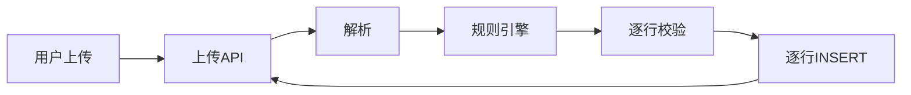
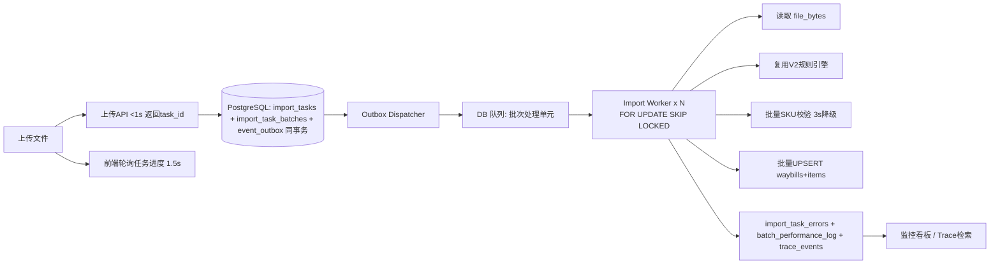

# 架构设计：V4 异步事件驱动导入链路

## 重构前（同步阻塞）

问题：请求等待全流程、大文件超时、逐行写库打满连接池、失败难定位。

## 重构后（异步事件驱动）

## 核心模式与落地
| 模式 | 落地 |
|---|---|
| 异步任务表 | import_tasks（total/processed/success/failed/trace_id/degraded） |
| 分批/分片 | import_task_batches（unit_id, batch_index, start/end_row, status, retry_count），1000 行/批 |
| Transactional Outbox | event_outbox 与任务同事务（单条 CTE）；Dispatcher 轮询投递，pending/sent/failed + retry_count + next_retry_at |
| 批量校验 | 批次内收集 SKU 一次 `= ANY(...)` 查询；必填/电话/数量/重复编码行级校验 |
| 批量写入 | 行暂存分片并发 INSERT；waybills `ON CONFLICT(dedup_key) DO UPDATE`；items 先清后插 |
| 精细化错误 | import_task_errors（batch/row/field/raw_value脱敏/error_code/reason/suggestion/trace_id） |
| 性能日志 | batch_performance_log（parse/rule/validate/insert/total ms） |
| 链路追踪 | trace_id 贯穿 API→Outbox→Worker→DB；trace_events 时间线 |

## 队列选型说明
采用 **PostgreSQL 事务性 Outbox 即队列**（DB-based queue）：满足强制 Outbox 与「等效异步任务系统」，无需额外 Redis 凭据；`FOR UPDATE SKIP LOCKED` 提供并发控制与防重复消费。生产如需更高吞吐可换 BullMQ+Upstash Redis 或常驻 Worker（Railway/Render），Worker 逻辑（lib/v4/worker.ts）可复用。

## 状态机
pending → processing → completed / partial_success / failed；批次 pending→processing→done/failed（retry_count≤3，卡死 90s 回收）。

## 幂等与去重
UNIQUE(task_id,unit_id)；行暂存 ON CONFLICT DO NOTHING；waybills dedup_key 唯一；items 先清后插；进度按已完成批次原子重算。

## 接口
POST /api/import-tasks；GET /api/import-tasks；GET /api/import-tasks/:id；GET .../errors；GET .../batches；GET /api/traces/:traceId；GET /api/traces；GET /api/import-monitor/summary；POST /api/internal/pump。

## 事件契约
统一信封 {event_id,event_type,schema_version,aggregate_id,trace_id,occurred_at,payload}。事件：ImportTaskCreated/ImportBatchCreated/ImportBatchStarted/ImportBatchSucceeded/ImportBatchFailed/ImportTaskCompleted/ImportTaskPartialSuccess/ImportTaskDegraded。版本策略：新增字段向后兼容，消费者忽略未知字段；语义变化升级 schema_version。
